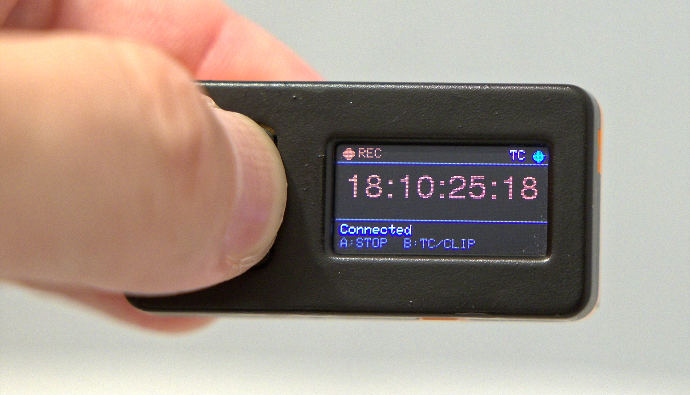

# ⏱️ MagicPilot Remote Stick

### 🎬 Timecode and record button for your Blackmagic camera, on a tiny M5Stick.

A pocket-sized Bluetooth LE remote for the original M5Stick (80×160 screen). It shows the camera's **live timecode** and starts or stops **recording** with one press. Small sibling of [MagicPilot Remote](https://github.com/KenFilms/MagicPilot_Remote), whose Bluetooth code it is based on.

## 🕹 Buttons

| Screen | Button | Action |
| --- | --- | --- |
| Main | **A** (front) | Connect; once connected, start/stop recording |
| Main | **B** (side) | Switch between timecode and clip counter |
| PIN | **B** | Next digit value (0-9); hold for back one digit |
| PIN | **A** | Accept digit; after the 6th digit, submit the PIN |

## 🔗 Pairing

Put the camera in Bluetooth pairing mode, press **A** on the stick, then enter the 6-digit PIN shown on the camera.

## 🚀 Build and flash

**PlatformIO:** `pio run -t upload`

**Arduino IDE:**
1. Install the **esp32 by Espressif Systems** board package (**2.0.17**) and the **M5StickC** library.
2. Open `MagicPilot_Remote_Stick.ino` with the `src` folder next to it.
3. Select the board **M5Stick-C** and the partition scheme **Huge APP (3MB No OTA/1MB SPIFFS)**, then upload.

## ⚠️ Disclaimer

Use at your own risk. MagicPilot is provided "as is" without warranty. The developer is not
responsible or liable for damage, malfunction, loss of footage, data loss, or any
other loss or damage to cameras, lenses, recording media, accessories, equipment, or
property resulting from the use of this software or firmware. Always verify
settings, compatibility, and operation before using MagicPilot with valuable or
professional equipment.

MagicPilot is an independent open-source project and is not affiliated with,
endorsed by, or sponsored by Blackmagic Design Pty. Ltd. Blackmagic Design,
Blackmagic Pocket Cinema Camera, BMPCC, and related names and trademarks are the
property of Blackmagic Design Pty. Ltd. MagicPilot is developed independently for use
with compatible Blackmagic cameras.
